# 安装使用

openEuler 社区版分为长期支持版本（LTS）和创新版本，并提供多种环境以便开发者[下载使用](https://www.openeuler.org/zh/download/get-os/)。

## 1. 公有云上 openEuler 镜像使用指南

目前，社区已经将多个版本的 openEuler 云镜像发布到公有云厂商以方便用户使用 openEuler。

### 1. 1 可用版本

以下是主流公有云上已发布的 openEuler 镜像版本：

- **AWS Marketplace**

| Version         | AMI ID                | Arch    |
| :-------------- | :-------------------- | :------ |
| 22.03-LTS-SP1 2 | ami-0baeb9308b134d488 | x86_64  |
| 22.03-LTS-SP1   | ami-03231b47c646ab173 | aarch64 |
| 22.03-LTS-SP2   | ami-0eceb9e642c0299f8 | x86_64  |
| 22.03-LTS-SP2   | ami-067e1b0f491b95db2 | aarch64 |
| 22.03-LTS-SP3   | ami-0145435b3931b0fe7 | x86_64  |
| 22.03-LTS-SP3   | ami-01677a5af1dee0f72 | aarch64 |
| 23.09           | ami-08556c9d0dd2f0a01 | x86_64  |
| 23.09           | ami-051484777fe029d4e | aarch64 |

- **华为云商店**

| Version         | Arch    |
| :-------------- | :------ |
| 22.03-LTS-SP2 1 | x86_64  |
| 22.03-LTS-SP2   | aarch64 |
| 22.03-LTS-SP3   | x86_64  |
| 22.03-LTS-SP3   | aarch64 |
| 23.09           | x86_64  |
| 23.09           | aarch64 |

注意，腾讯云还未大规模使用arm算力，发布时国内很多区不可用，因此未在腾讯云上发布openEuler的arm镜像。

### 1.2 创建openEuler云实例

以在华为云上创建云主机（实例）为例，说明公有云上openEuler的使用方法

 - 登陆华为云并进入控制台

   

 - 选择弹性云服务器ECS

  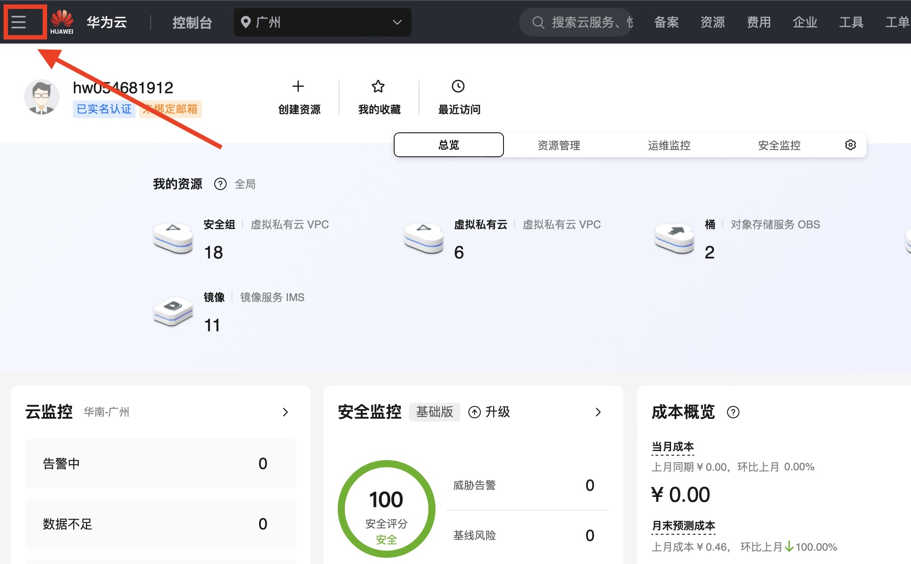
  

 - 购买弹性云服务器并配置

  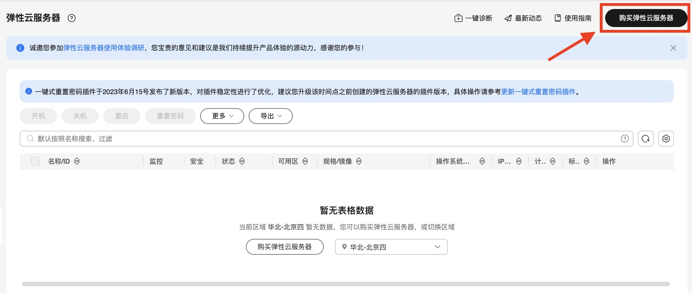

  1. 配置算力资源

  


  2. 选择openEuler镜像

  
  
  


  3. 进行网络配置

  
  

  4. 设置登录方式
 
  
  
 **需要注意华为云商店要求发布的镜像禁止root用户登录** ，因此这里设置的root用户仅限于控制台登录，如果用户需要使用root权限，则可通过控制台登入后修改`/etc/ssh/sshd_config`文件进行配置。

  5. 完成购买

  

  6. 登录使用

  等待创建的云主机状态变成运行中即可进行远程登录。

   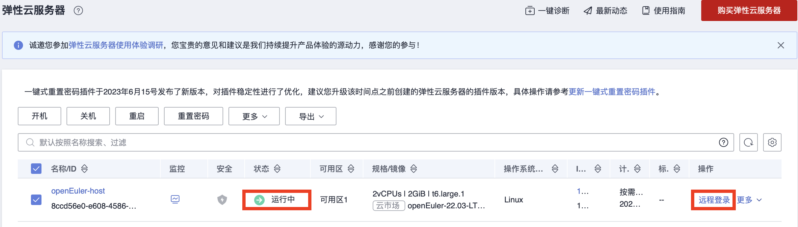
  
由于华为云商店发布镜像的要求，openEuler镜像启动的主机 **禁止以root用户登录、禁止使用密码认证** ，其默认用户为openeuler。
因此，主机在正常使用之前需要通过步骤4设置的root用户在控制台登录修改`/etc/ssh/sshd_config`文件的配置项以满足要求，具体配置如下：


```
# /etc/ssh/sshd_config

# 允许以root用户登录
PermitRootLogin yes
# 允许使用密码认证登录
PasswordAuthentication yes
```

修改完成后即可在任意终端使用ssh以root用户密码登录：


```
$ ssh root@1.92.159.107

  Authorized users only. All activities may be monitored and reported.
  root@1.92.159.107's password: 

  Authorized users only. All activities may be monitored and reported.
  Last login: Mon Apr 29 11:03:05 2024


  Welcome to 5.10.0-182.0.0.95.oe2203sp3.x86_64

  System information as of time: 	2024年 04月 29日 星期一 11:19:11 UTC

  System load: 	0.00
  Processes: 	80
  Memory used: 	3.7%
  Swap used: 	0.0%
  Usage On: 	4%
  IP address: 	192.168.0.231
  Users online: 	2

 [root@openeuler-host ~]# 
```

其他云上openEuler镜像的使用方式与华为云相似，详细使用方法可参考对应云上商品的使用指南。

### 1.3 Hello World

至此，创建的openEuler云主机已经可以进行开发活动，让我们一起写出openEuler上的第一个Hello World'


```
# hello_world.py
print("Hello, world!")
```

使用python3运行


```
[root@openeuler-host ~]# python3 hello_world.py 
Hello, World!
```


## 2. openEuler容器镜像部署指南

当前openEuler社区除过基础镜像之外，已经发布和上线了20+核心的开源应用镜像，本文着重分享openEuler基础镜像的安装和使用的初步实践，如果您对openEuler社区其他镜像感兴趣，欢迎大家使用和体验。

### 2.1 基础镜像简介


   1. 容器镜像仓库

openEuler官方容器镜像仓库，包含openEuler基础镜像、应用镜像。在这里，你可以找到相应镜像的使用和介绍。

       - [openeuler-docker-images](https://gitee.com/openeuler/openeuler-docker-images)
   
   2. 基础镜像地址

openEuler的基础镜像官方地址
      - [repo.openeuler.org](https://repo.openeuler.org/)

   3. 基础镜像版本

         - [20.03-lts](https://repo.openeuler.org/openEuler-20.03-LTS/docker_img/)
         - [20.03-lts-sp1](https://repo.openeuler.org/openEuler-20.03-LTS-SP1/docker_img/)
	  - [20.03-lts-sp2](https://repo.openeuler.org/openEuler-20.03-LTS-SP2/docker_img/)
	  - [20.03-lts-sp3](https://repo.openeuler.org/openEuler-20.03-LTS-SP3/docker_img/)
	  - [20.03-lts-sp4, 20.03](https://repo.openeuler.org/openEuler-20.03-LTS-SP4/docker_img/)
	  - [20.09](https://archives.openeuler.openatom.cn/openEuler-20.09/docker_img/)
	  - [21.03](https://archives.openeuler.openatom.cn/openEuler-21.03/docker_img/)
	  - [21.09](https://archives.openeuler.openatom.cn/openEuler-21.09/docker_img/)
	  - [22.03-lts](https://repo.openeuler.org/openEuler-22.03-LTS/docker_img/)
	  - [22.09](https://archives.openeuler.openatom.cn/openEuler-22.09/docker_img/)
	  - [22.03-lts-sp1](https://repo.openeuler.org/openEuler-22.03-LTS-SP1/docker_img/)
	  - [22.03-lts-sp2](https://repo.openeuler.org/openEuler-22.03-LTS-SP2/docker_img/)
	  - [22.03-lts-sp3, 22.03, latest](https://repo.openeuler.org/openEuler-22.03-LTS-SP3/docker_img/)
	  - [23.03](https://repo.openeuler.org/openEuler-23.03/docker_img/)
	  - [23.09](https://repo.openeuler.org/openEuler-23.09/docker_img/)

### 2.2 镜像仓库

基础镜像和应用镜像支持的版本会发布到以下平台的镜像仓库，供开发者下载和使用。

   - [hub.docker.com](https://hub.docker.com/)
   - [quay.io](https://quay.io/)
   - [hub.oepkgs.net](https://hub.oepkgs.net/)
   - [repo.openeuler.org](https://repo.openeuler.org/)

### 2.3 镜像部署流程

#### 2.3.1 准备环境

* windows系统需要准备一台虚拟机
* mac系统可以使用自带的shell终端

#### 2.3.2 部署docker

```bash
#1、执行docker安装命令，已安装docker或下载docker客户端，跳过
dnf -y install docker  # 虚拟机安装docker示例, mac系统需自行安装

# 2、docker安装成功后，如docker安装成功，可以看到安装的版本
docker version 
```

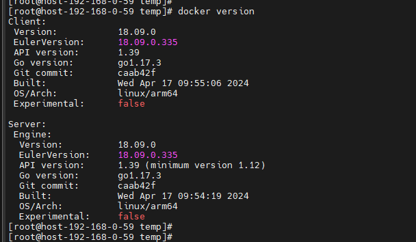

#### 2.3.3 拉取镜像

> 镜像版本一般采用最新版本，如需其他版本替换**latest**为对应版本即可。拉取和运行都不建议以默认方式运行， 防止国外镜像容器网络问题导致网络不稳定。

```bash
# 拉取方式一: 默认方式，国内环境不建议使用
docker pull openeuler/openeuler:latest
# 拉取方式二：指定国内仓库，国内用户推荐使用
docker pull hub.oepkgs.net/openeuler/openeuler:latest
```

```bash
#镜像拉取完成后可以看到
docker images 
```

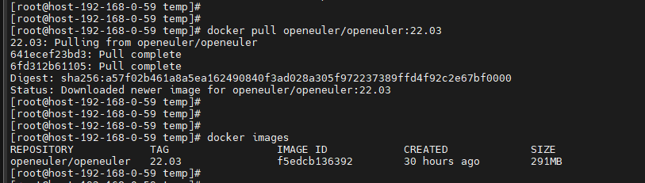

#### 2.3.4 运行容器

> 镜像版本一般采用最新版本，如需其他版本替换**latest**为对应版本即可。

```bash
# 运行方式一: 默认方式，国内环境不建议使用
docker run -it  openeuler/openeuler:latest
# 运行方式二：指定国内仓库，国内用户推荐使用
docker run -it  hub.oepkgs.net/openeuler/openeuler:latest
```
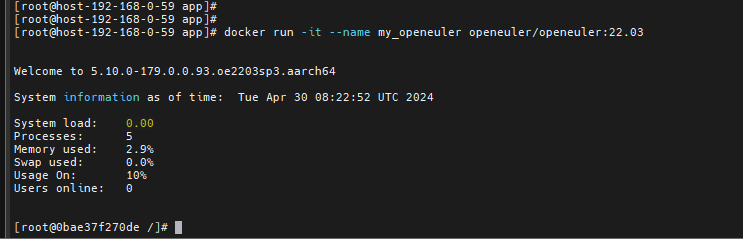


#### 2.3.5 容器运行测试

编写测试脚本，openeuler默认自带python3工具，可以编写一个简单的HelloWorld脚本测试。

参考如下:

```bash
# 打开文件编辑器
vi HelloWorld.py
```

```bash
# 按键insert或者i键开始编辑
```

```bash
# 输入测试程序
print("Hello, world!")
```

```bash
# 按键esc 退出编辑 按键 shift+:  输入wq! 保存文件
```

```bash
# 执行python脚本，测试程序
python3 HelloWorld.py
```

文件编辑示例

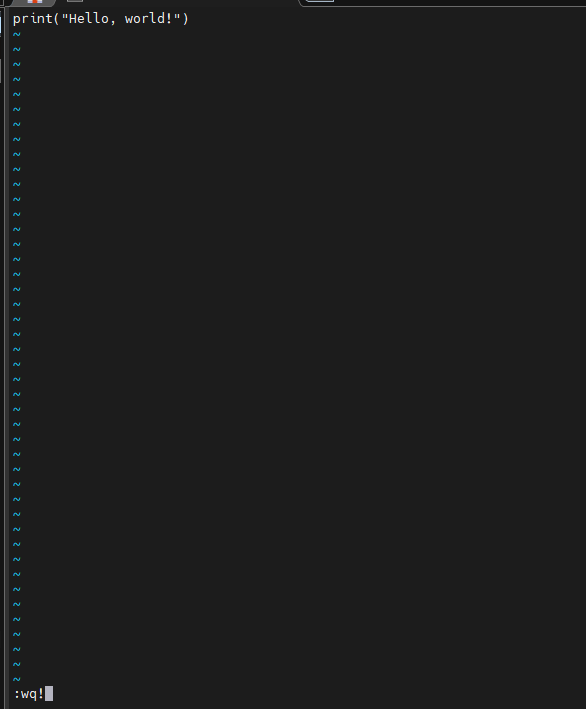

程序运行示例

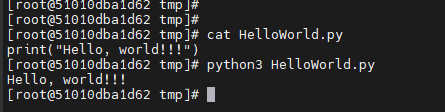


## 3. 如何在openEuler WSL中体验完整的桌面环境

[WSL(Windows Subsystem For Linux)](https://learn.microsoft.com/en-us/windows/wsl/about) 是微软发布的让用户能够在windows上使用Linux环境的技术

而通过使用openEuler发布的WSL应用，则可以让大家在Windows中体验原汁原味的openEuler开发环境

目前openEuler已经将 openEuler 20.03-LTS，22.03-LTS，22.03，23.03等版本相继上架到了[微软应用商店](https://apps.microsoft.com/search?query=openeuler&hl=en-us&gl=US)，欢迎大家下载试用。

如果无法访问应用商店，还可以参考[之前的文章，使用sideload](https://mp.weixin.qq.com/s?__biz=MzkyMjYzNjU0Ng==&mid=2247507510&idx=2&sn=a1b4af27d9773605217745fd05ddb61c&source=41#wechat_redirect)。

### 3.1 openEuler User Repo

为了丰富openEuler的软件包生态，社区也推出了[openEuler用户软件仓系统(EUR)](https://eur.openeuler.openatom.cn/)，关于EUR更详细的介绍和使用指南可以参考这篇博文或者[官方博客1](https://www.openeuler.org/zh/blog/waaagh/openEuler-user-repo-howto.html)和[官方博客2](https://www.openeuler.org/zh/blog/waaagh/openEuler-user-repo-intro.html)

当您在使用openEuler时发现缺少某些软件包或已有包不满足需要，EUR就是您最好的帮手

### 3.2 WSL + EUR

笔者自己是重度Linux桌面用户，在使用openEuler WSL的过程中，也一直期望能够用上原生的DE（Desktop Environment）

当前WSL社区主流的桌面解决方案是[kex](https://www.kali.org/docs/wsl/win-kex/)，而kex又是kali linux独家的软件包，但kex的Seamless Mode其实是借助了xrdp来实现的

可惜openEuler社区暂时没有引入xrdp这个软件包

不过在EUR和WSL的加持下，我们是不是也可尝试为openEuler添加xrdp并在WSL下使用xrdp体验桌面环境呢？

Talk is cheap，借助EUR和WSL的一番折腾，最后终于实现了在Windows中完全使用openEuler 桌面环境进行开发的小目标

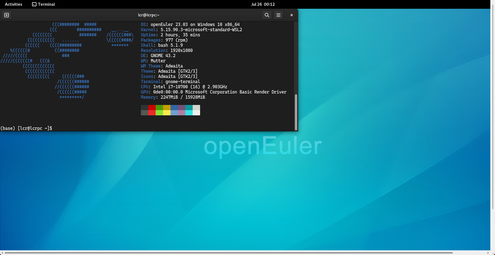

下面是个人折腾的步骤，最终结果是在openEuler 23.03的WSL中使用Gnome桌面环境：

- 在 windows server 中安装 WSL：

    - 本文步骤均在openEuler 23.03版本上执行，如果无法访问windows store，可以下载[最新发布的openEuler 22.03-LTS-SP2的WSL sideload安装包](https://repo.openeuler.org/openEuler-22.03-LTS-SP2/WSL/openEuler-WSL-22.03.zip)，如果是通过应用商店途径安装，则可以跳过下面2步

    - 下载后首先安装证书：双击压缩包中的 **DistroLauncher-Appx_2203.1.164.0_x64_ARM64.cer** ，依次选择安装证书->本地计算机->将所有的证书都放入下列存储->受信任的人

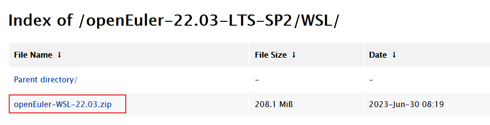

- 安装sideload应用：以管理员权限开启一个powershell终端，并执行压缩包中的Add-AppDevPackage.ps1脚本

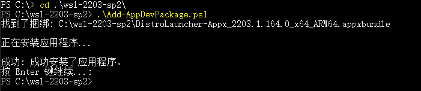

- 初始化WSL环境：安装完成后，在开始菜单即可找到openEuler 22.03/23.03的应用图标，双击即可启动，启动后跟随引导初始化账号密码即可开始体验WSL环境


- 安装桌面环境：本文采用xrdp的方式来实现WSL中的桌面环境，由于xrdp包还不存在于openEuler官方仓库，笔者在[EUR](https://eur.openeuler.openatom.cn/coprs/mywaaagh_admin/xrdp/)中引入了最新的0.9.22.1版本：

- 首先获取23.03版本EUR仓库配置，其他版本可以到[这里](https://eur.openeuler.openatom.cn/coprs/mywaaagh_admin/xrdp/)获取


```
$ sudo curl -o /etc/yum.repos.d/xrdp.repo -L https://eur.openeuler.openatom.cn/coprs/mywaaagh_admin/xrdp/repo/openeuler-23.03/mywaaagh_admin-xrdp-openeuler-23.03.repo

We trust you have received the usual lecture from the local System
Administrator. It usually boils down to these three things:

    #1) Respect the privacy of others.
    #2) Think before you type.
    #3) With great power comes great responsibility.

[sudo] password for lcr:
% Total    % Received % Xferd  Average Speed   Time    Time     Time  Current
                                Dload  Upload   Total   Spent    Left  Speed
100   379  100   379    0     0   1237      0 --:--:-- --:--:-- --:--:--  1238
```

- 接着，安装xrdp和gnome相关的软件包

```
这里输入代码
```


```
$ sudo dnf in xrdp gnome-terminal gdm neofetch
...
Total                                                                                   1.2 MB/s | 358 MB     05:05
Copr repo for xrdp owned by mywaaagh_admin                                              7.0 kB/s | 1.0 kB     00:00
Importing GPG key 0xA893D75B:
Userid     : "mywaaagh_admin_xrdp (None) <mywaaagh_admin#xrdp@copr.osinfra.cn>"
Fingerprint: 945E 21A6 D982 49A7 A61A E62A 026A 219C A893 D75B
From       : https://eur.openeuler.openatom.cn/results/mywaaagh_admin/xrdp/pubkey.gpg
Is this ok [y/N]: y
...

Complete!
```

- 随后，启动xrdp和gdm服务


```
sudo systemctl start xrdp
sudo systemctl restart gdm
```

- 最后，通过windows的mstsc.exe命令即可访问刚刚启动的xrdp服务，WSL的IP可以通过ip a命令获取


```
$ ip a
1: lo: <LOOPBACK,UP,LOWER_UP> mtu 65536 qdisc noqueue state UNKNOWN group default qlen 1000
    link/loopback 00:00:00:00:00:00 brd 00:00:00:00:00:00
    inet 127.0.0.1/8 scope host lo
    valid_lft forever preferred_lft forever
    inet6 ::1/128 scope host
    valid_lft forever preferred_lft forever
2: eth0: <BROADCAST,MULTICAST,UP,LOWER_UP> mtu 1500 qdisc mq state UP group default qlen 1000
    link/ether 00:15:5d:1a:3f:30 brd ff:ff:ff:ff:ff:ff
    inet 172.29.191.92/20 brd 172.29.191.255 scope global eth0
    valid_lft forever preferred_lft forever
    inet6 fe80::215:5dff:fe1a:3f30/64 scope link
    valid_lft forever preferred_lft forever
(base) [lcr@lcrpc cascadia-code-nerd-fonts-mono]$
```

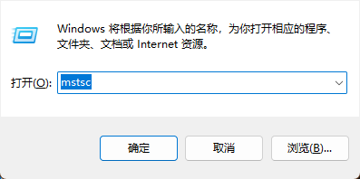

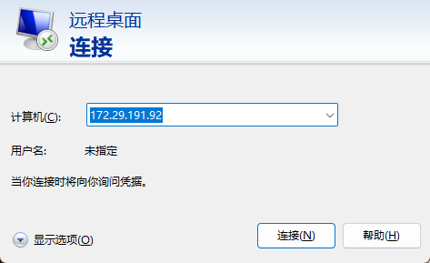

- 在远程桌面连接后，选择Xvnc，在填入WSL首次启动是创建的用户名和密码，即可进入openEuler的gnome桌面

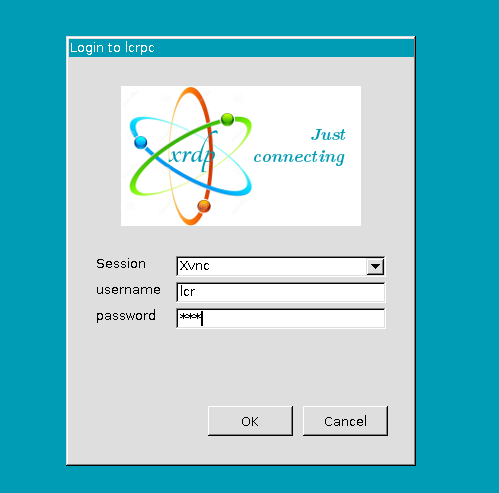


### 注意事项

- 由于多个WSL实例是共享网络的，因此在其中一个实例开启xrdp后，再另外一个WSL中启动服务会失败，此时可以通过修改/etc/xrdp/xrdp.ini和/etc/xrdp/sesman.ini中的监听端口实现开启多个实例的远程桌面

- 有时连接远程桌面成功后会出现窗口闪退，可能是系统中残留了一些X-session，这种情况可以尝试重启gdm服务


```
sudo systemctl restart gdm
```

- 截图的gnome-termial中使用的字体是自己打包的cascadia-code-nerd-fonts-mono，也托管在EUR的xrdp仓库中上，可以通过dnf in cascadia-code-nerd-fonts-mono来进行安装

- 理论上xrdp通过/etc/xrdp/startwm.sh能够启动任意的桌面环境，在$HOME/.xsession中可以添加任意桌面会话的进程，例如要启动i3，只需要echo i3 > $HOME/.xsession && chmod +x ~/.xsession即可，在xrdp连接时，就会启动一个i3的会话

