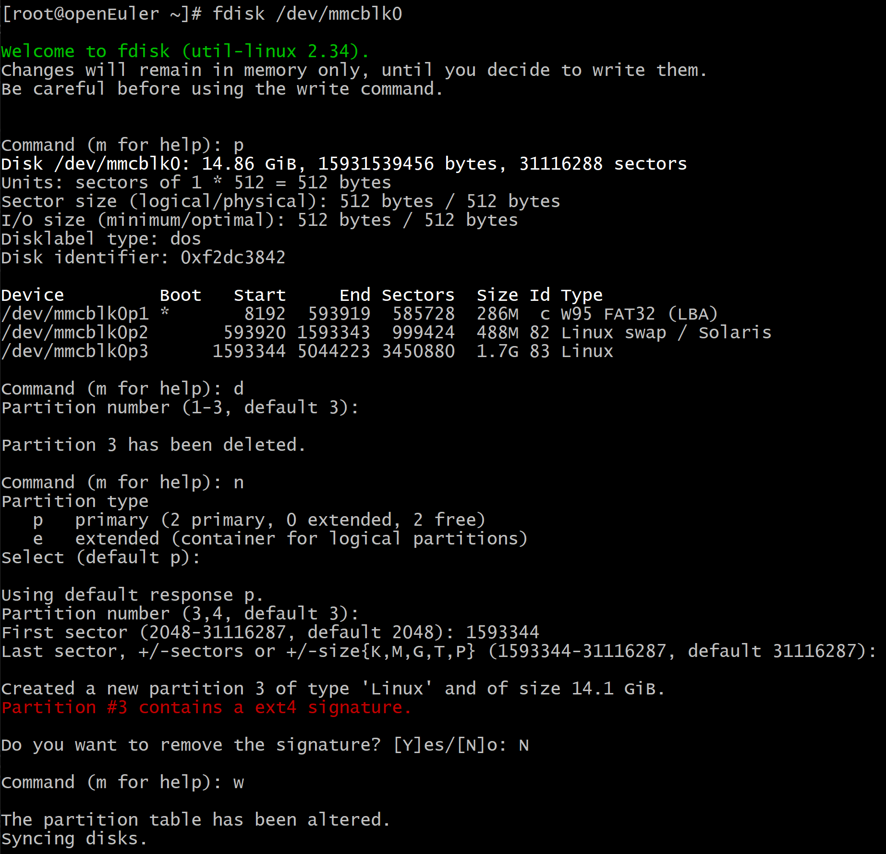

# 在树莓派上安装openEuler

本文是介绍 openEuler 操作系统安装在树莓派的方法。本文将以“openEuler 24.03 LTS”为例介绍整体的安装流程。

openEuler下载地址: <https://www.openeuler.org/zh/download> 

## 安装准备

在安装开始前，您需要获取openEuler发布的树莓派镜像及其校验文件。

### 获取安装源

1. 登录[openEuler Repo](https://repo.openeuler.org/)网站。
2. 在列表内选择需要的版本，进入该版本的下载列表，本文以“openEuler 24.03 LTS”为例介绍整体的安装流程。
3. 单击“raspi_img”，进入树莓派镜像的下载列表。
4. 单击“openEuler-24.03-LTS-raspi-aarch64.img.xz”，将 openEuler 发布的树莓派镜像下载到本地。
5. 单击“openEuler-24.03-LTS-raspi-aarch64.img.xz.sha256sum”，将 openEuler 发布的树莓派镜像的校验文件下载到本地。

### 镜像完整性校验

#### 简介

为了防止软件包在传输过程中由于网络原因或者存储设备原因出现下载不完整的问题，在获取到软件包后，需要对软件包的完整性进行校验，通过了校验的软件包才能部署。

这里通过对比校验文件中记录的校验值和手动方式计算的文件校验值，判断软件包是否完整。若两个值相同，说明下载的文件完整，否则，下载的文件完整性被破坏，请重新获取软件包。

#### 前提条件

在校验镜像文件的完整性之前，需要准备如下文件：

镜像文件：openEuler-24.03-LTS-raspi-aarch64.img.xz

校验文件：openEuler-24.03-LTS-raspi-aarch64.img.xz.sha256sum

#### 操作指导

文件完整性校验操作步骤如下：

1. 获取校验文件中的校验值。执行命令如下：

    ```shell
    cat openEuler-24.03-LTS-raspi-aarch64.img.xz.sha256sum
    ```

2. 计算文件的 sha256 校验值。执行命令如下：

    ```shell
    sha256sum openEuler-24.03-LTS-raspi-aarch64.img.xz
    ```

    命令执行完成后，输出校验值。

3. 对比步骤 1 和步骤 2 计算的校验值是否一致。

    如果校验值一致说明下载的文件完整性没有被破坏，如果校验值不一致则可以确认文件完整性已被破坏，需要重新获取。

### 安装要求

在树莓派环境上安装 openEuler 操作系统，则树莓派需要满足如下的硬件兼容性和最小硬件要求。

#### 硬件兼容支持

openEuler 树莓派版本镜像目前支持树莓派 3B/3B+/4B。

#### 最小硬件要求

openEuler 树莓派版本镜像所需的最小硬件要求如[表1](#tff48b99c9bf24b84bb602c53229e2542)所示。

**表 1**  最小硬件要求

<a name="tff48b99c9bf24b84bb602c53229e2542"></a>

<table><thead align="left"><tr id="r36f08b63edea4973a8228200caa2a50b"><th class="cellrowborder" valign="top" width="11.19111911191119%" id="mcps1.2.4.1.1"><p id="aef3575d97cdf4dcfb65f8d0c8d2d4a76"><a name="aef3575d97cdf4dcfb65f8d0c8d2d4a76"></a><a name="aef3575d97cdf4dcfb65f8d0c8d2d4a76"></a><strong id="abf63bde6a66a4ce5b21d81948fcafe36"><a name="abf63bde6a66a4ce5b21d81948fcafe36"></a><a name="abf63bde6a66a4ce5b21d81948fcafe36"></a>部件名称</strong></p>
</th>
<th class="cellrowborder" valign="top" width="40.06400640064006%" id="mcps1.2.4.1.2"><p id="a919d3bb266c8432fb33c51fa8f3a4fc3"><a name="a919d3bb266c8432fb33c51fa8f3a4fc3"></a><a name="a919d3bb266c8432fb33c51fa8f3a4fc3"></a><strong id="a9386cf027c1e47d99651159bb62130e7"><a name="a9386cf027c1e47d99651159bb62130e7"></a><a name="a9386cf027c1e47d99651159bb62130e7"></a>最小硬件要求</strong></p>
</th>
<th class="cellrowborder" valign="top" width="48.74487448744874%" id="mcps1.2.4.1.3"><p id="a3ac7cf4867974c4990ee6deab716db5f"><a name="a3ac7cf4867974c4990ee6deab716db5f"></a><a name="a3ac7cf4867974c4990ee6deab716db5f"></a><strong id="a0206841e981640cf833dc2556a7def50"><a name="a0206841e981640cf833dc2556a7def50"></a><a name="a0206841e981640cf833dc2556a7def50"></a>说明</strong></p>
</th>
</tr>
</thead>
<tbody>
<tr id="ra68eff5c33a84bb2be6672a48a643d26"><td class="cellrowborder" valign="top" width="11.19111911191119%" headers="mcps1.2.4.1.1 "><p id="ac0a50d2069ab444cafff180647772df4"><a name="ac0a50d2069ab444cafff180647772df4"></a><a name="ac0a50d2069ab444cafff180647772df4"></a>树莓派版本</p>
</td>
<td class="cellrowborder" valign="top" width="40.06400640064006%" headers="mcps1.2.4.1.2 "><a name="ul97131912175915"></a><a name="ul97131912175915"></a><ul id="ul97131912175915"><li>树莓派 3B</li><li>树莓派 3B+</li><li>树莓派 4B</li><li>树莓派 400</li></ul>
</td>
<td class="cellrowborder" valign="top" width="48.74487448744874%" headers="mcps1.2.4.1.3 "><p id="a2601e9eece5f4c7bb02881c9ac647a61"><a name="a2601e9eece5f4c7bb02881c9ac647a61"></a><a name="a2601e9eece5f4c7bb02881c9ac647a61"></a>-</p>
</td>
</tr>
<tr id="rf2a5d43b74894a0882b7c17bdfeb697f"><td class="cellrowborder" valign="top" width="11.19111911191119%" headers="mcps1.2.4.1.1 "><p id="ad00611ec129a41a9841fb579eece7804"><a name="ad00611ec129a41a9841fb579eece7804"></a><a name="ad00611ec129a41a9841fb579eece7804"></a>内存</p>
</td>
<td class="cellrowborder" valign="top" width="40.06400640064006%" headers="mcps1.2.4.1.2 "><p id="a94efe642b8694e5a85747e123b951efc"><a name="a94efe642b8694e5a85747e123b951efc"></a><a name="a94efe642b8694e5a85747e123b951efc"></a>不小于 2GB（为了获得更好的应用体验，建议至少 4GB）</p>
</td>
<td class="cellrowborder" valign="top" width="48.74487448744874%" headers="mcps1.2.4.1.3 "><p id="abfb44d28dca741f68df94e4e276d2410"><a name="abfb44d28dca741f68df94e4e276d2410"></a><a name="abfb44d28dca741f68df94e4e276d2410"></a>-</p>
</td>
</tr>
<tr id="rd2c1ebd93ea64e85a5f3fc88dc5ba456"><td class="cellrowborder" valign="top" width="11.19111911191119%" headers="mcps1.2.4.1.1 "><p id="afd36954546334c1681b5a391bbc386ae"><a name="afd36954546334c1681b5a391bbc386ae"></a><a name="afd36954546334c1681b5a391bbc386ae"></a>硬盘</p>
</td>
<td class="cellrowborder" valign="top" width="40.06400640064006%" headers="mcps1.2.4.1.2 "><p id="p1224172312719"><a name="p1224172312719"></a><a name="p1224172312719"></a>为了获得更好的应用体验，建议不小于 8GB</p>
</td>
<td class="cellrowborder" valign="top" width="48.74487448744874%" headers="mcps1.2.4.1.3 "><p id="acc0affdd82e34f32966171e21855ef40"><a name="acc0affdd82e34f32966171e21855ef40"></a><a name="acc0affdd82e34f32966171e21855ef40"></a>-</p>
</td>
</tr>
</tbody>
</table>

## 安装方式介绍

>**注意：**
>
>- 硬件仅支持树莓派 3B/3B+/4B/400。
>- 采用刷写镜像到 SD 卡方式安装。本章节提供 Windows/Linux/Mac 上刷写镜像的操作方法。
>- 本章节使用的镜像是参考上文“安装准备”获取 openEuler 的树莓派版本镜像。

<!-- TOC -->

- [在树莓派上安装openEuler](#在树莓派上安装openeuler)
  - [安装准备](#安装准备)
    - [获取安装源](#获取安装源)
    - [镜像完整性校验](#镜像完整性校验)
      - [简介](#简介)
      - [前提条件](#前提条件)
      - [操作指导](#操作指导)
    - [安装要求](#安装要求)
      - [硬件兼容支持](#硬件兼容支持)
      - [最小硬件要求](#最小硬件要求)
  - [安装方式介绍](#安装方式介绍)
    - [Windows 下刷写镜像](#windows-下刷写镜像)
      - [格式化 SD 卡](#格式化-sd-卡)
      - [写入 SD 卡](#写入-sd-卡)
    - [Linux 下刷写镜像](#linux-下刷写镜像)
      - [查看磁盘分区信息](#查看磁盘分区信息)
      - [卸载 SD 卡挂载点](#卸载-sd-卡挂载点)
      - [写入 SD 卡](#写入-sd-卡-1)
    - [Mac 下刷写镜像](#mac-下刷写镜像)
      - [查看磁盘分区信息](#查看磁盘分区信息-1)
      - [卸载 SD 卡挂载点](#卸载-sd-卡挂载点-1)
      - [写入 SD 卡](#写入-sd-卡-2)
  - [安装指导](#安装指导)
    - [启动系统](#启动系统)
    - [登录系统](#登录系统)
    - [配置系统](#配置系统)
      - [扩展根目录分区](#扩展根目录分区)
      - [连接 WIFI](#连接-wifi)

<!-- /TOC -->

### Windows 下刷写镜像

本节以 Windows 10 为例，介绍如何在 Windows 环境下将镜像刷写到 SD 卡。

#### 格式化 SD 卡

请按照以下步骤格式化 SD 卡：

1. 下载并安装格式化 SD 卡工具，以下操作以 SD Card Formatter 格式化工具为例。
2. 打开 SD Card Formatter，在 “Select card” 中选择需要格式化的 SD 卡的盘符。

    若 SD 卡之前未安装过镜像，盘符只有一个。在 “Select card” 中选择需要格式化的 SD 卡对应盘符。

    若 SD 卡之前安装过镜像，盘符会有一个或多个。例如，SD 卡对应三个盘符：E、G、H。在 “Select card” 中选择需要格式化的 SD 卡对应 boot 分区盘符 E。

3. 在 “Formatting options” 中选择格式化方式。默认为 “Quick format”。
4. 单击“Format”开始格式化。界面通过进度条显示格式化进度。
5. 格式化完成后会弹出 “Formatting was successfully completed” 的提示框，单击“确定”完成格式化。

#### 写入 SD 卡

>**注意：**
>如果获取的是压缩后的镜像文件“openEuler-{version}-raspi-aarch64.img.xz”，需要先将压缩文件解压得到 “openEuler-{version}-raspi-aarch64.img”镜像文件。

请按照以下步骤将“openEuler-{version}-raspi-aarch64.img”镜像文件写入 SD 卡：

1. 下载并安装刷写镜像的工具，以下操作以 Win32 Disk Imager 工具为例。
2. 右键选择“以管理员身份运行”，打开 Win32 Disk Imager。
3. 在“映像文件”中选择 img 格式的镜像文件路径。
4. 在“设备”中选择待写入的 SD 卡盘符。
5. 单击“写入”。界面通过任务进度条显示写入 SD 卡的进度。
6. 写入完成后会弹出 “写入成功” 的提示框，单击“OK”完成写入。

### Linux 下刷写镜像

本节介绍如何在 Linux 环境下将镜像刷写到SD卡。

#### 查看磁盘分区信息

在 root 权限下执行 `fdisk -l` 获取 SD 卡磁盘信息，例如 SD 卡对应磁盘为 /dev/sdb。

#### 卸载 SD 卡挂载点

1. 执行 `df -lh` 命令查看当前已挂载的卷。
2. 如果 SD 卡对应的分区未挂载，则跳过该步骤；如果 SD 卡对应分区已挂载，如 SD 卡对应的两个分区 /dev/sdb1 和 /dev/sdb3 已挂载，则需要卸载对应分区，在 root 权限下执行以下命令：

    `umount /dev/sdb1`

    `umount /dev/sdb3`

#### 写入 SD 卡

1. 如果获取的是压缩后的镜像，需要先执行 `xz -d openEuler-{version}-raspi-aarch64.img.xz` 命令将压缩文件解压得到“openEuler-{version}-raspi-aarch64.img”镜像文件；否则，跳过该步骤。
2. 将镜像 `openEuler-{version}-raspi-aarch64.img` 刷写入 SD 卡，在 root 权限下执行以下命令：

    `dd bs=4M if=openEuler-{version}-raspi-aarch64.img of=/dev/sdb`

    >**说明：**
    >一般情况下，将块大小设置为 4M。如果写入失败或者写入的镜像无法使用，可以尝试将块大小设置为 1M 重新写入，但是设置为 1M 比较耗时。

### Mac 下刷写镜像

本节介绍如何在 Mac 环境下将镜像刷写到SD卡。

#### 查看磁盘分区信息

在 root 权限下执行 `diskutil list` 获取 SD 卡磁盘信息，例如 SD 卡对应磁盘为 /dev/disk3。

#### 卸载 SD 卡挂载点

1. 执行 `df -lh` 命令查看当前已挂载的卷。
2. 如果 SD 卡对应的分区未挂载，则跳过该步骤；如果 SD 卡对应分区已挂载，如 SD 卡对应的两个分区 /dev/disk3s1 和 /dev/disk3s3 已挂载，则需要卸载对应分区，在 root 权限下执行以下命令：

    `diskutil umount /dev/disk3s1`

    `diskutil umount /dev/disk3s3`

#### 写入 SD 卡

1. 如果获取的是压缩后的镜像，需要先执行 `xz -d openEuler-{version}-raspi-aarch64.img.xz` 命令将压缩文件解压得到“openEuler-{version}-raspi-aarch64.img”镜像文件；否则，跳过该步骤。
2. 将镜像 `openEuler-{version}-raspi-aarch64.img` 刷入 SD 卡，在 root 权限下执行以下命令：

    `dd bs=4m if=openEuler-{version}-raspi-aarch64.img of=/dev/disk3`

    >**说明：**
    >一般情况下，将块大小设置为 4m。如果写入失败或者写入的镜像无法使用，可以尝试将块大小设置为 1m 重新写入，但是设置为 1m 比较耗时。

## 安装指导

本章介绍将“树莓派镜像刷写入 SD 卡”后，启用树莓派的主要过程。
<!-- TOC -->

- [安装指导](#安装指导)
    - [启动系统](#启动系统)
    - [登录系统](#登录系统)
    - [配置系统](#配置系统)
        - [扩展根目录分区](#扩展根目录分区)
        - [连接 WIFI](#连接-wifi)

<!-- /TOC -->

### 启动系统

将刷写镜像后的 SD 卡插入树莓派，通电启用。

树莓派硬件相关信息请参考[树莓派官网](https://www.raspberrypi.org/)。

### 登录系统

登录树莓派有以下两种方式：

1. 本地登录

    树莓派连接显示器（树莓派视频输出接口为 Micro HDMI）、键盘、鼠标后，启动树莓派，可以看到树莓派启动日志输出到显示器上。待树莓派启动成功，输入用户名（root）和密码（openeuler）登录。

2. ssh 远程登录

    树莓派默认采用 DHCP 的方式自动获取 IP。如果树莓派连接已知路由器，可登录路由器查看，新增的 IP 即为树莓派 IP。例如，树莓派对应 IP 为：192.168.31.109，使用命令 `ssh root@192.168.31.109` 后输入密码 `openeuler`，即可远程登录树莓派。

### 配置系统

#### 扩展根目录分区

默认根目录分区空间比较小，在使用之前，需要对分区进行扩容。

请按照以下步骤扩展根目录分区：

1. 在 root 权限下执行 `fdisk -l` 命令查看磁盘分区信息。命令和回显如下：

    ```
    # fdisk -l
    Disk /dev/mmcblk0: 14.86 GiB, 15931539456 bytes, 31116288 sectors
    Units: sectors of 1 * 512 = 512 bytes
    Sector size (logical/physical): 512 bytes / 512 bytes
    I/O size (minimum/optimal): 512 bytes / 512 bytes
    Disklabel type: dos
    Disk identifier: 0xf2dc3842

    Device         Boot   Start     End Sectors  Size Id Type
    /dev/mmcblk0p1 *       8192  593919  585728  286M  c W95 FAT32 (LBA)
    /dev/mmcblk0p2       593920 1593343  999424  488M 82 Linux swap / Solaris
    /dev/mmcblk0p3      1593344 5044223 3450880  1.7G 83 Linux
    ```

    SD 卡对应盘符为 /dev/mmcblk0，包括 3 个分区，分别为

    - /dev/mmcblk0p1：引导分区
    - /dev/mmcblk0p2：交换分区
    - /dev/mmcblk0p3：根目录分区

    这里我们需要将根目录分区 `/dev/mmcblk0p3` 进行扩容。

2. 在 root 权限下执行 `fdisk /dev/mmcblk0` 命令进入到交互式命令行界面，按照以下步骤扩展分区，如[图 1](#zh-cn_topic_0151920806_f6ff7658b349942ea87f4521c0256c315)所示。

    1. 输入 `p`，查看分区信息。

        记录分区 `/dev/mmcblk0p3` 的起始扇区号，即 `/dev/mmcblk0p3` 分区信息中 `Start` 列的值，示例中为 `1593344`。

    2. 输入 `d`，删除分区。
    3. 输入 `3` 或直接按 `Enter`，删除序号为 `3` 的分区，即 `/dev/mmcblk0p3` 分区。
    4. 输入 `n`，创建新的分区。
    5. 输入 `p` 或直接按 `Enter`，创建 `Primary` 类型的分区。
    6. 输入 `3` 或直接按 `Enter`，创建序号为 `3` 的分区，即 `/dev/mmcblk0p3` 分区。
    7. 输入新分区的起始扇区号，即第 `1` 步中记录的起始扇区号，示例中为 `1593344`。

        >**须知：**
        >请勿直接按“Enter”或使用默认参数。

    8. 按 `Enter`，使用默认的最后一个扇区号作为新分区的终止扇区号。
    9. 输入 `N`，不修改扇区标记。
    10. 输入 `w`，保存分区设置并退出交互式命令行界面。

    **图 1**  分区扩容<a name="zh-cn_topic_0151920806_f6ff7658b349942ea87f4521c0256c315"></a>  

    

3. 在 root 权限下执行 `fdisk -l` 命令查看磁盘分区信息，以确保磁盘分区正确。命令和回显如下：

    ```
    # fdisk -l
    Disk /dev/mmcblk0: 14.86 GiB, 15931539456 bytes, 31116288 sectors
    Units: sectors of 1 * 512 = 512 bytes
    Sector size (logical/physical): 512 bytes / 512 bytes
    I/O size (minimum/optimal): 512 bytes / 512 bytes
    Disklabel type: dos
    Disk identifier: 0xf2dc3842

    Device         Boot   Start      End  Sectors  Size Id Type
    /dev/mmcblk0p1 *       8192   593919   585728  286M  c W95 FAT32 (LBA)
    /dev/mmcblk0p2       593920  1593343   999424  488M 82 Linux swap / Solaris
    /dev/mmcblk0p3      1593344 31116287 29522944 14.1G 83 Linux
    ```

4. 在 root 权限下执行 `resize2fs /dev/mmcblk0p3`，增大未加载的文件系统大小。
5. 执行 `df -lh` 命令查看磁盘空间信息，以确保根目录分区已扩展。

    >**注意：**
    >如果根目录分区未扩展，可执行 `reboot` 命令重启树莓派之后再在 root 权限下执行 `resize2fs /dev/mmcblk0p3`。

#### 连接 WIFI

请按照以下步骤连接 WIFI：

1. 查看 IP 和网卡信息

    `ip a`

    获取无线网卡 wlan0 信息：

    ```
    1: lo: <LOOPBACK,UP,LOWER_UP> mtu 65536 qdisc noqueue state UNKNOWN group default qlen 1000
        link/loopback 00:00:00:00:00:00 brd 00:00:00:00:00:00
        inet 127.0.0.1/8 scope host lo
        valid_lft forever preferred_lft forever
        inet6 ::1/128 scope host
        valid_lft forever preferred_lft forever
    2: eth0: <BROADCAST,MULTICAST,UP,LOWER_UP> mtu 1500 qdisc mq state UP group default qlen 1000
        link/ether dc:a6:32:50:de:57 brd ff:ff:ff:ff:ff:ff
        inet 192.168.31.109/24 brd 192.168.31.255 scope global dynamic noprefixroute eth0
        valid_lft 41570sec preferred_lft 41570sec
        inet6 fe80::cd39:a969:e647:3043/64 scope link noprefixroute
        valid_lft forever preferred_lft forever
    3: wlan0: <NO-CARRIER,BROADCAST,MULTICAST,UP> mtu 1500 qdisc fq_codel state DOWN group default qlen 1000
        link/ether e2:e6:99:89:47:0c brd ff:ff:ff:ff:ff:ff
    ```

2. 扫描可以连接的 WIFI 信息

    `nmcli dev wifi`

3. 连接 WIFI

    在 root 权限下执行 `nmcli dev wifi connect SSID password PWD` 命令连接 WIFI。

    其中，`SSID` 为上一步扫描到的可供连接的 WIFI 的 SSID，`PWD` 为对应 WIFI 的密码。例如，`SSID` 为 `openEuler-wifi`，密码为 `12345678`，则连接该 WIFI 命令为：`nmcli dev wifi connect openEuler-wifi password 12345678`，连接成功：

    ```
    Device 'wlan0' successfully activated with '26becaab-4adc-4c8e-9bf0-1d63cf5fa3f1'.
    ```

4. 查看 IP 和无线网卡信息

    `ip a`

    ```
    1: lo: <LOOPBACK,UP,LOWER_UP> mtu 65536 qdisc noqueue state UNKNOWN group default qlen 1000
        link/loopback 00:00:00:00:00:00 brd 00:00:00:00:00:00
        inet 127.0.0.1/8 scope host lo
        valid_lft forever preferred_lft forever
        inet6 ::1/128 scope host
        valid_lft forever preferred_lft forever
    2: eth0: <BROADCAST,MULTICAST,UP,LOWER_UP> mtu 1500 qdisc mq state UP group default qlen 1000
        link/ether dc:a6:32:50:de:57 brd ff:ff:ff:ff:ff:ff
        inet 192.168.31.109/24 brd 192.168.31.255 scope global dynamic noprefixroute eth0
        valid_lft 41386sec preferred_lft 41386sec
        inet6 fe80::cd39:a969:e647:3043/64 scope link noprefixroute
        valid_lft forever preferred_lft forever
    3: wlan0: <BROADCAST,MULTICAST,UP,LOWER_UP> mtu 1500 qdisc fq_codel state UP group default qlen 1000
        link/ether dc:a6:32:50:de:58 brd ff:ff:ff:ff:ff:ff
        inet 192.168.31.110/24 brd 192.168.31.255 scope global dynamic noprefixroute wlan0
        valid_lft 43094sec preferred_lft 43094sec
        inet6 fe80::394:d086:27fa:deba/64 scope link noprefixroute
        valid_lft forever preferred_lft forever
    ```
