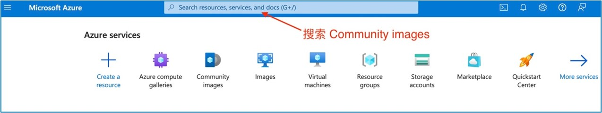
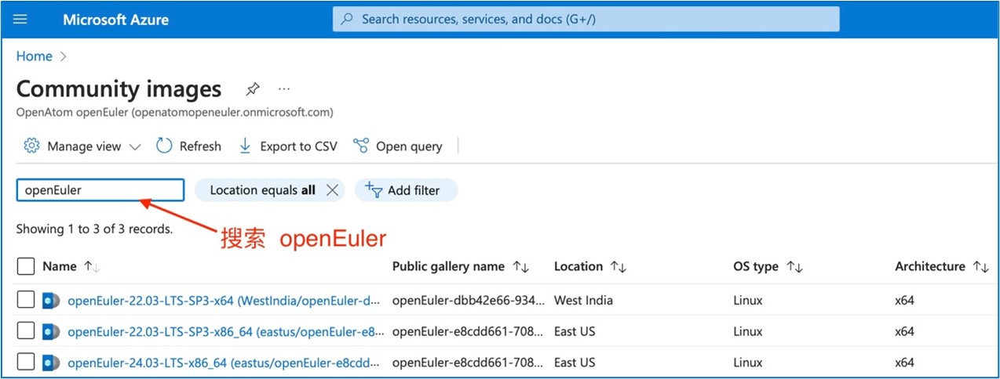
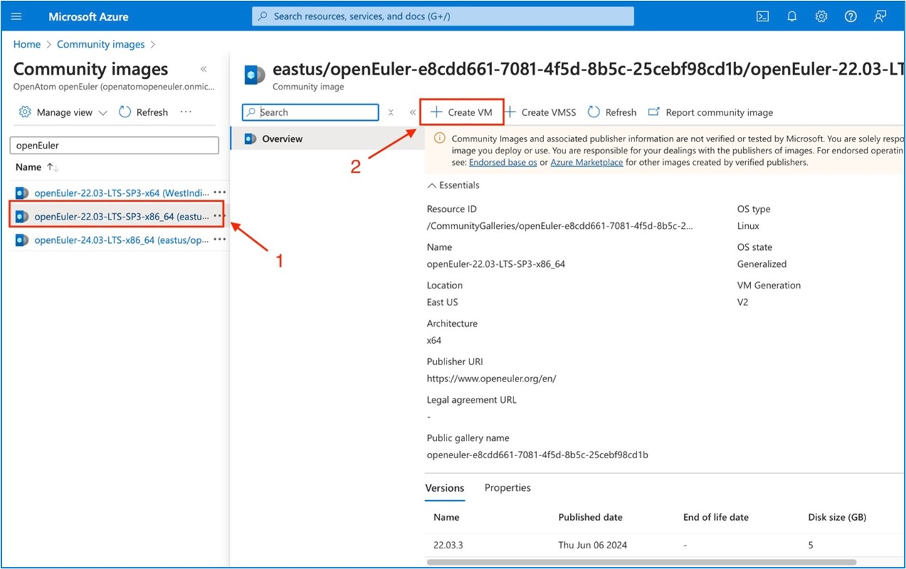

## Azure获取openEuler共享镜像

#### 步骤 1 

登录 [Azure Portal](https://portal.azure.com/)

#### 步骤 2 

进入账户主页搜索：Community images 服务并进入

#### 步骤 3 

在 Community images 服务页面搜索关键词：openEuler，即可看到可用的 openEuler 镜像

#### 步骤 4 

点击目标镜像，即可创建 VM

