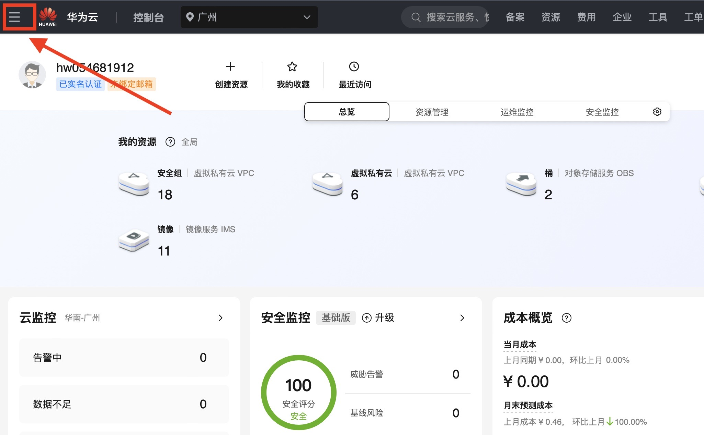
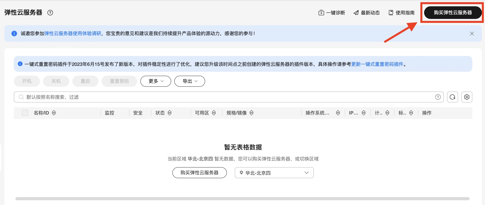
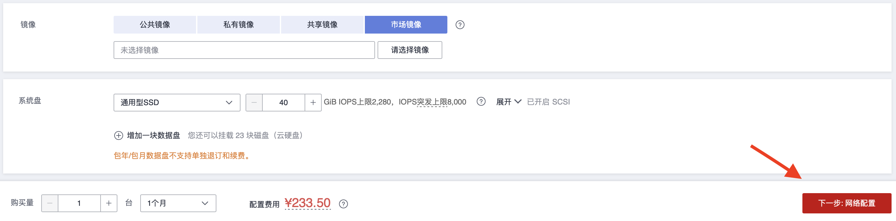
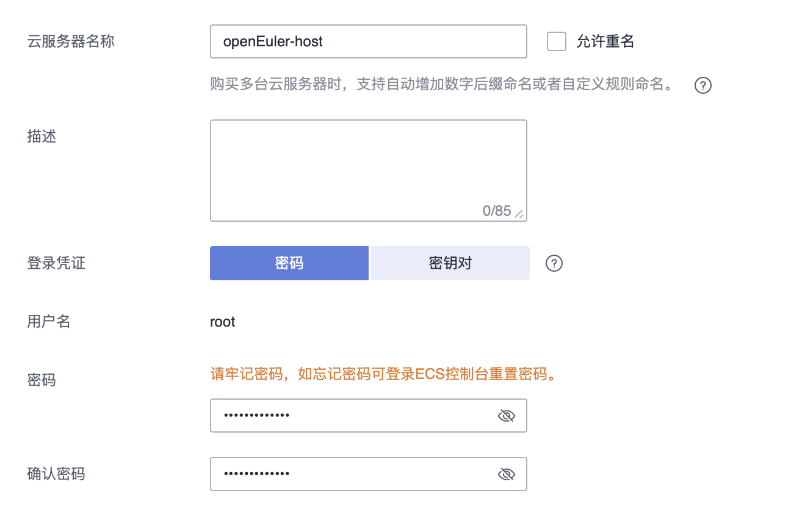
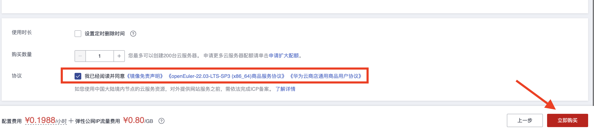
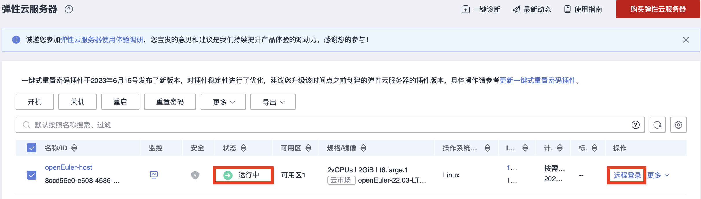

## 在华为云获取openEuler镜像

以在华为云上创建云主机（实例）为例，说明公有云上 openEuler 的使用方法

### 登陆华为云并进入控制台


### 选择弹性云服务器 ECS




### 购买弹性云服务器并配置



1. **配置算力资源**
   
2. **选择 openEuler 镜像**
   
   
   
3. **进行网络配置**
   
   
4. **设置登录方式**
   
   **需要注意华为云商店要求发布的镜像禁止 root 用户登录** ，因此这里设置的 root 用户仅限于控制台登录，如果用户需要使用 root 权限，则可通过控制台登入后修改`/etc/ssh/sshd_config`文件进行配置。
5. **完成购买**
   
6. **登录使用**

   等待创建的云主机状态变成运行中即可进行远程登录。
   

   由于华为云商店发布镜像的要求，openEuler 镜像启动的主机 **禁止以 root 用户登录、禁止使用密码认证** ，其默认用户为 openeuler。因此，主机在正常使用之前需要通过步骤 4 设置的 root 用户在控制台登录修改`/etc/ssh/sshd_config`文件的配置项以满足要求，具体配置如下：

   ```
   # /etc/ssh/sshd_config

   # 允许以root用户登录
   PermitRootLogin yes
   # 允许使用密码认证登录
   PasswordAuthentication yes
   ```

   修改完成后即可在任意终端使用 ssh 以 root 用户密码登录：

   ```
   $ ssh root@1.92.159.107

     Authorized users only. All activities may be monitored and reported.
     root@1.92.159.107's password:

     Authorized users only. All activities may be monitored and reported.
     Last login: Mon Apr 29 11:03:05 2024


     Welcome to 5.10.0-182.0.0.95.oe2203sp3.x86_64

     System information as of time: 	2024年 04月 29日 星期一 11:19:11 UTC

     System load: 	0.00
     Processes: 	80
     Memory used: 	3.7%
     Swap used: 	0.0%
     Usage On: 	4%
     IP address: 	192.168.0.231
     Users online: 	2

    [root@openeuler-host ~]#
   ```

<br/>

**其他云上 openEuler 镜像的使用方式与华为云相似，详细使用方法可参考对应云上商品的使用指南。**


