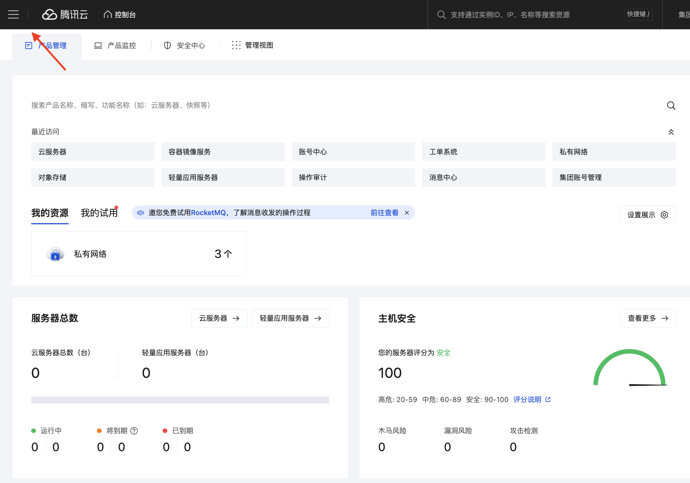
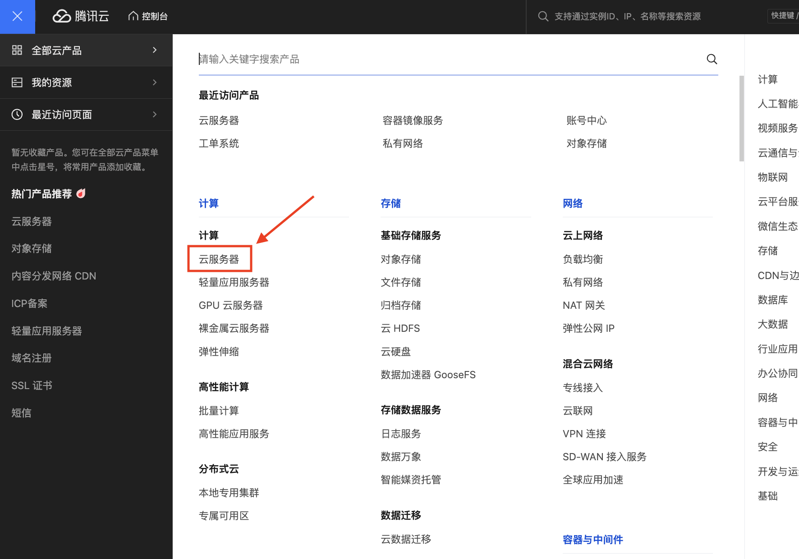
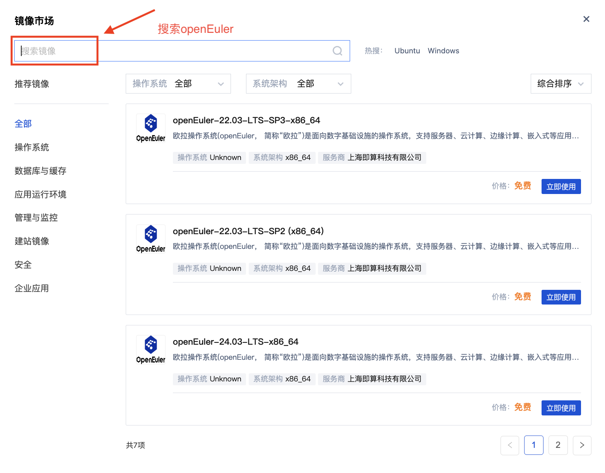

## 在腾讯云获取openEuler镜像

#### 步骤 1 

登陆腾讯云控制台 <https://console.cloud.tencent.com/>

#### 步骤 2 

展开选项卡，选择云服务器

#### 步骤 3 

进入实例列表，选择目标实例类型

#### 步骤 4 

选择自定义配置

#### 步骤 5

进入云镜像市场，搜索openEuler

#### 步骤 6 选择目标版本创建实例

