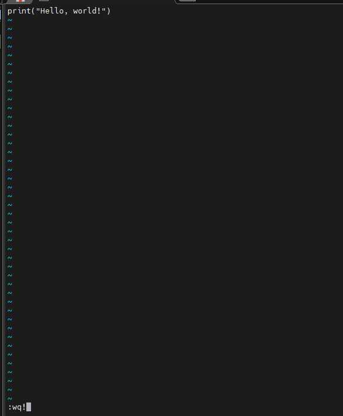

# openEuler容器镜像部署指南

当前 openEuler 社区除过基础镜像之外，已经发布和上线了 20+核心的开源应用镜像，本文着重分享 openEuler 基础镜像的安装和使用的初步实践，如果您对 openEuler 社区其他镜像感兴趣，欢迎大家使用和体验。

## 基础镜像简介

1. 容器镜像仓库

   openEuler 官方容器镜像仓库，包含 openEuler 基础镜像、应用镜像。在这里，你可以找到相应镜像的使用和介绍。- [openeuler-docker-images](https://gitee.com/openeuler/openeuler-docker-images)

2. 基础镜像地址

   openEuler 的基础镜像官方地址 - [repo.openeuler.org](https://repo.openeuler.org/)

3. 基础镜像版本

   - [20.03-lts](https://repo.openeuler.org/openEuler-20.03-LTS/docker_img/)
   - [20.03-lts-sp1](https://repo.openeuler.org/openEuler-20.03-LTS-SP1/docker_img/)
   - [20.03-lts-sp2](https://repo.openeuler.org/openEuler-20.03-LTS-SP2/docker_img/)
   - [20.03-lts-sp3](https://repo.openeuler.org/openEuler-20.03-LTS-SP3/docker_img/)
   - [20.03-lts-sp4, 20.03](https://repo.openeuler.org/openEuler-20.03-LTS-SP4/docker_img/)
   - [20.09](https://archives.openeuler.openatom.cn/openEuler-20.09/docker_img/)
   - [21.03](https://archives.openeuler.openatom.cn/openEuler-21.03/docker_img/)
   - [21.09](https://archives.openeuler.openatom.cn/openEuler-21.09/docker_img/)
   - [22.03-lts](https://repo.openeuler.org/openEuler-22.03-LTS/docker_img/)
   - [22.09](https://archives.openeuler.openatom.cn/openEuler-22.09/docker_img/)
   - [22.03-lts-sp1](https://repo.openeuler.org/openEuler-22.03-LTS-SP1/docker_img/)
   - [22.03-lts-sp2](https://repo.openeuler.org/openEuler-22.03-LTS-SP2/docker_img/)
   - [22.03-lts-sp3, 22.03, latest](https://repo.openeuler.org/openEuler-22.03-LTS-SP3/docker_img/)
   - [23.03](https://repo.openeuler.org/openEuler-23.03/docker_img/)
   - [23.09](https://repo.openeuler.org/openEuler-23.09/docker_img/)

## 镜像仓库

基础镜像和应用镜像支持的版本会发布到以下平台的镜像仓库，供开发者下载和使用。

- [hub.docker.com](https://hub.docker.com/)
- [quay.io](https://quay.io/)
- [hub.oepkgs.net](https://hub.oepkgs.net/)
- [repo.openeuler.org](https://repo.openeuler.org/)

## 镜像部署流程

### 1. 准备环境

- windows 系统需要准备一台虚拟机
- mac 系统可以使用自带的 shell 终端

### 2. 部署 docker

```bash
#1、执行docker安装命令，已安装docker或下载docker客户端，跳过
dnf -y install docker  # 虚拟机安装docker示例, mac系统需自行安装

# 2、docker安装成功后，如docker安装成功，可以看到安装的版本
docker version
```


### 3. 拉取镜像

> 镜像版本一般采用最新版本，如需其他版本替换**latest**为对应版本即可。拉取和运行都不建议以默认方式运行， 防止国外镜像容器网络问题导致网络不稳定。

```bash
# 拉取方式一: 默认方式，国内环境不建议使用
docker pull openeuler/openeuler:latest
# 拉取方式二：指定国内仓库，国内用户推荐使用
docker pull hub.oepkgs.net/openeuler/openeuler:latest
```

```bash
#镜像拉取完成后可以看到
docker images
```


### 4. 运行容器

> 镜像版本一般采用最新版本，如需其他版本替换**latest**为对应版本即可。

```bash
# 运行方式一: 默认方式，国内环境不建议使用
docker run -it  openeuler/openeuler:latest
# 运行方式二：指定国内仓库，国内用户推荐使用
docker run -it  hub.oepkgs.net/openeuler/openeuler:latest
```


### 5. 容器运行测试

编写测试脚本，openeuler 默认自带 python3 工具，可以编写一个简单的 HelloWorld 脚本测试。

参考如下:

```bash
# 打开文件编辑器
vi HelloWorld.py
```

```bash
# 按键insert或者i键开始编辑
```

```bash
# 输入测试程序
print("Hello, world!")
```

```bash
# 按键esc 退出编辑 按键 shift+:  输入wq! 保存文件
```

```bash
# 执行python脚本，测试程序
python3 HelloWorld.py
```

文件编辑示例



程序运行示例


## 在OrbStack中获取openEuler

Mac 平台的轻量级虚拟机平台 [OrbStack](https://orbstack.dev/) 支持 openEuler 发行版。
开发者通过<https://orbstack.dev/download>下载后，点击创建虚拟机，选择 openEuler 版本，创建成功后即可在命令行中使用 openEuler，步骤见下图。


