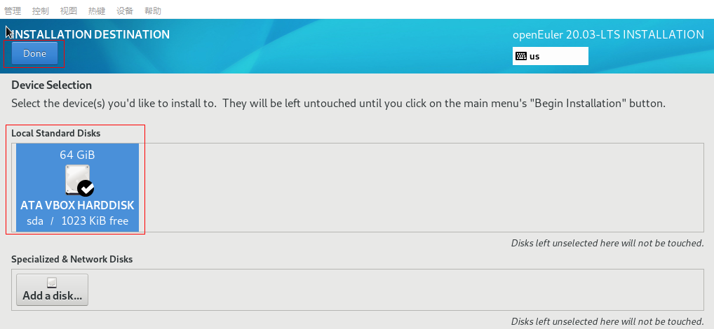
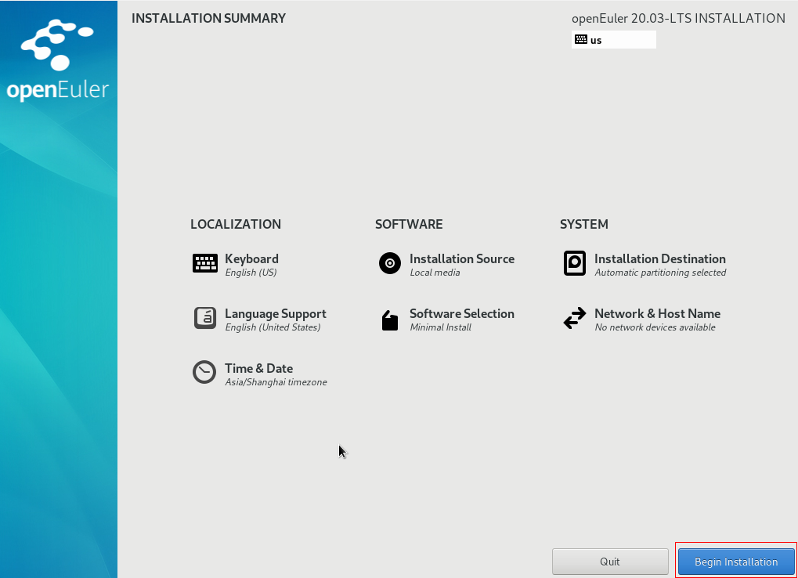
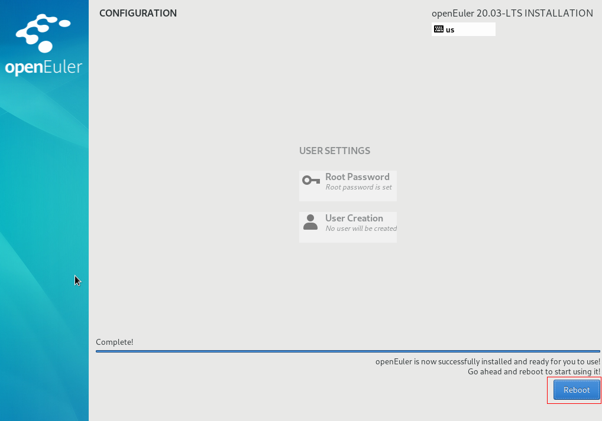
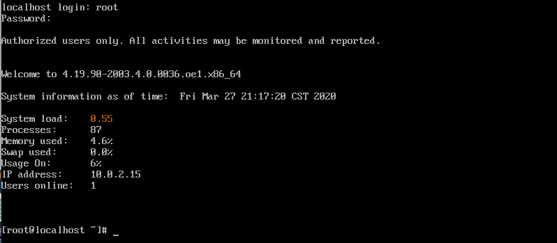

# windows 下使用 VirtualBox 安装 openEuler

## 环境准备

- Windows10 64 位
- Oracle VM VirtualBox 6.1.4
- openEuler 开源社区下载：[openEuler-20.03-LTS-x86_64-dvd.iso](https://repo.openeuler.org/openEuler-20.03-LTS/ISO/x86_64/openEuler-20.03-LTS-x86_64-dvd.iso)（X86）

## 安装步骤

### 1. 下载安装 Virtual Box

在 [VirtualBox 官网](https://www.virtualbox.org/wiki/Downloads)下载安装程序

安装的时候可以自定义安装路径如（D:\software\Oracle\VirtualBox），然后一路 next 即可；

安装结束之后，使用`Ctrl+G`打开全局设置，修改默认虚拟电脑位置如（D:\myVM），方便之后查找;

### 2. 创建虚拟机

选择 【控制】-->【新建】，填写虚拟机的配置信息，示例如下

名称：openEuler，类型：Linux，由于没有 openEuler，所以版本选择 Other Linux(64-bit)，下一步

设置虚拟机的内存，此内存即为虚拟机所占用的系统内存，这里将虚拟内存设置为 4G

选择【现在创建虚拟硬盘(c)】

虚拟硬盘文件类型，选择默认的【VDI（VirtualBox 磁盘映像）】，下一步

选择【动态分配】，下一步

分配给虚拟机的内存空间较大，使用时逐渐占用磁盘空间，闲置时自动缩减比较合理

这里选择设置虚拟机硬盘大小为 64G

虚拟机创建完成，openEuler 所需的硬件资源准备完毕

### 3. 安装 openEuler

启动上一步创建好的虚拟机

点击右侧“文件夹图标”

点击注册，选择准备阶段下载好的 openEuler-20.03-LTS-x86_64-dvd.iso

选择【启动】，进入到安装界面

选择 【Install openEuler 20.03-LTS】回车，进行安装

选择 Continue

选择 Installation Destination

选择要安装的磁盘，Done

选择 Begin Installation

安装状态如下

选择 Root Password 设置 root 用户的密码（后面登录要用到！~）

安装完成后，选择 Reboot 重启虚拟机

显示重新回到了安装界面

关闭虚拟机，选择【设置】选中 openEuler-20.03-LTS-x86_64-dvd.iso，鼠标右键，删除盘片，保存退出

重新启动虚拟机，显示如下界面，直接回车

输入用户（root）密码（安装阶段设置的密码），进入 openEuler 虚拟机

到这里 openEuler 虚拟机已经安装完成了~
