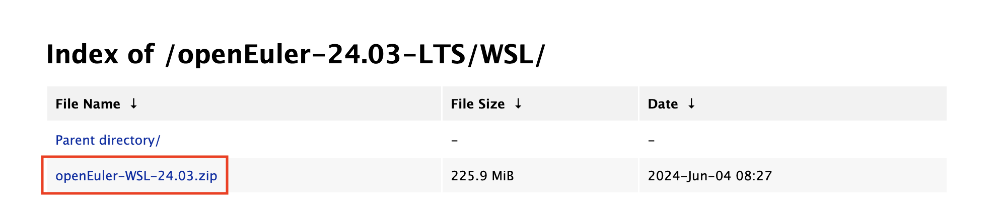
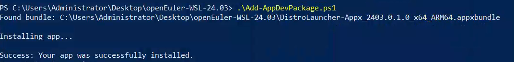
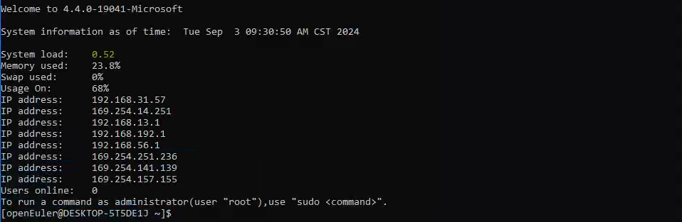

# 如何使用WSL在Windows上安装openEuler

[WSL(Windows Subsystem For Linux)](https://learn.microsoft.com/en-us/windows/wsl/about) 是微软发布的让用户能够在 windows 上使用 Linux 环境的技术。

而通过使用 WSL 应用，可以让大家在 Windows 中体验原汁原味的 openEuler 开发环境。

目前 openEuler 已经将 openEuler 20.03-LTS，22.03-LTS，22.03，23.03，24.03等版本相继上架到了[微软应用商店](https://apps.microsoft.com/search?query=openeuler&hl=en-us&gl=US)，欢迎大家下载试用。

您也可以在openEuler官网查看最新的版本：<https://www.openeuler.org/zh/download>

如果无法访问应用商店，还可以参考[之前的文章，使用 sideload](https://mp.weixin.qq.com/s?__biz=MzkyMjYzNjU0Ng==&mid=2247507510&idx=2&sn=a1b4af27d9773605217745fd05ddb61c&source=41#wechat_redirect)。

下面是个人折腾的步骤，最终结果是使用 WSL 在Windows 中成功安装 openEuler 24.03：

- 在 windows server 中安装 WSL：
  - 本文步骤均在 openEuler 24.03 版本上执行，如果无法访问 windows store，可以下载[最新发布的 openEuler 24.03-LTS 的 WSL sideload 安装包](https://repo.openeuler.org/openEuler-24.03-LTS/WSL/openEuler-WSL-24.03.zip)，如果是通过应用商店途径安装，则可以跳过下面 2 步。
  - 下载后首先安装证书：双击压缩包中的 **DistroLauncher-Appx_2403.0.1.0_x64_ARM64.cer** ，依次选择安装证书->本地计算机->将所有的证书都放入下列存储->受信任的人。

- 安装 sideload 应用：以管理员权限开启一个 powershell 终端，并执行压缩包中的 Add-AppDevPackage.ps1 脚本。

- 初始化 WSL 环境：安装完成后，在开始菜单即可找到 openEuler 24.03 的应用图标，双击即可启动，启动后跟随引导初始化账号密码即可开始体验 WSL 环境。

